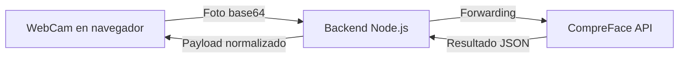
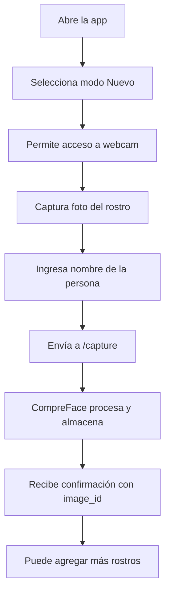
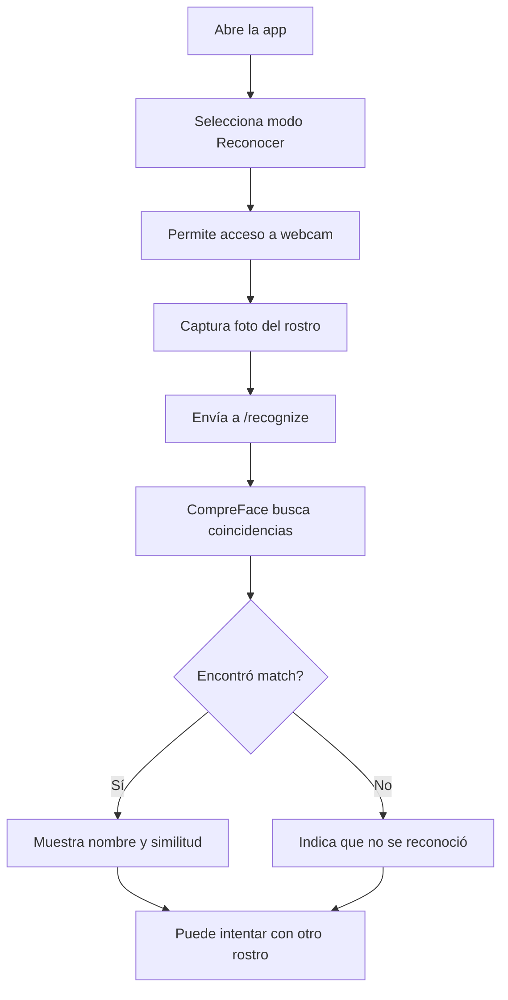

<div align="center">

# 🧠 FaceApp

<p align="center">
   
   
   
   
   
   
   
</p>

<p align="center">
   <strong>Reconocimiento facial asistido por IA y CompreFace</strong><br/>
   Captura, almacena y reconoce rostros en tiempo real desde la web
</p>

<p align="center">
   <a href="https://comprefacefront-production.up.railway.app/" target="_blank">
      
   </a>
</p>

</div>

---

## 📌 Características principales

<table>
<tr>
<td width="50%" valign="top">

### 🖼️ Para Usuarios

- 📷 **Captura facial desde webcam**  
   Toma de imágenes en tiempo real desde el navegador
- 🆕 **Inscripción de nuevos rostros**  
   Guarda y asocia nombre a cada rostro
- 🔍 **Reconocimiento facial instantáneo**  
   Compara y detecta coincidencias en la galería
- 📊 **Resultados detallados**  
   Similitud, probabilidad y metadatos
- 🔄 **Interfaz reactiva**  
   Cambia entre modos "Nuevo" y "Reconocer"
- 🖥️ **UI responsiva**  
   Adaptada a móviles y desktop

</td>
<td width="50%" valign="top">

### ⚙️ Para Desarrolladores

- 🚀 **Backend Node.js + Express**  
   Endpoints `/capture` y `/recognize` para la API
- 🧠 **Integración con CompreFace**  
   Orquestación vía Docker Compose
- 🗂️ **Almacenamiento temporal**  
   Manejo de imágenes en carpetas locales
- 🧪 **API documentada**  
   Fácil de consumir desde cualquier frontend
- 🛠️ **Configuración sencilla**  
   Variables `.env` y scripts listos
- 🧩 **Extensible**  
   Pensado para agregar nuevas features

</td>
</tr>
</table>

---

<div align="center">

## 🛠️ Stack Tecnológico

</div>

<table align="center">
<tr>
<td align="center" width="96">

<br>Node.js 18+
</td>
<td align="center" width="96">

<br>Express
</td>
<td align="center" width="96">

<br>React 18
</td>
<td align="center" width="96">

<br>TypeScript
</td>
<td align="center" width="96">

<br>Vite
</td>
<td align="center" width="96">

<br>Docker
</td>
<td align="center" width="96">

<br>CompreFace
</td>
</tr>
</table>

<div align="center">

| Tecnología | Uso |
|:----------:|:---:|
| **Node.js + Express** | Backend y API REST |
| **CompreFace** | Motor de reconocimiento facial con IA |
| **React 18 + Vite** | Interfaz de usuario moderna y rápida |
| **TypeScript** | Tipado estricto en frontend |
| **Docker Compose** | Orquestación de servicios |
| **React Webcam** | Captura de imágenes desde navegador |

</div>

---

## 📂 Estructura del proyecto

```
FaceApp/
├── index.js                    # Entry point del backend
├── clientCompreFace.js         # Cliente para consumir CompreFace API
├── faceRecognice.js            # Lógica de reconocimiento facial
├── package.json                # Dependencias del backend
├── railway.toml                # Configuración de despliegue
├── CompreFaceDok/              # Stack Docker de CompreFace
│   └── docker-compose.yml      # Orquestación de servicios ML
├── FrontEnd/faceApp/           # Frontend React + Vite + TS
│   ├── src/
│   │   ├── App.tsx             # Componente principal
│   │   ├── main.tsx            # Entry point del frontend
│   │   ├── components/
│   │   │   ├── WebCapture.tsx  # Captura webcam y modos
│   │   │   └── AddManually.tsx # Agregar rostros manualmente
│   │   └── types/
│   │       └── index.ts        # Tipos TypeScript
│   ├── public/                 # Recursos estáticos
│   ├── package.json            # Dependencias del frontend
│   └── vite.config.ts          # Configuración Vite
├── image/                      # Imágenes almacenadas
├── TempImage/                  # Imágenes temporales
└── README.md                   # Este archivo
```

---

## 🔐 Seguridad y Privacidad

### Datos Locales
FaceApp procesa todas las imágenes de forma local y privada:

- **CompreFace auto-hosteado** - Motor de IA ejecutado localmente con Docker
- **Sin envío a terceros** - Las imágenes solo se procesan en tu infraestructura
- **Almacenamiento temporal** - Las imágenes se guardan localmente

### Configuración
- **Variables de entorno** - Claves y endpoints configurables en `.env`
- **API protegida** - Solo usuarios con acceso al frontend pueden usar la app
- **Control total** - Tú decides dónde y cómo se almacenan los datos

---

## 🧮 Funcionalidades técnicas destacadas

### API Endpoints
- **POST `/capture`** - Inscribe un nuevo rostro con nombre asociado
  - Body: `{ image: string (base64), name: string }`
  - Response: Detalles del rostro agregado con `image_id`
  
- **POST `/recognize`** - Busca coincidencias en la galería de rostros
  - Body: `{ image: string (base64) }`
  - Response: Lista de sujetos con similitud, probabilidad y bounding box

### Arquitectura de Datos


### Captura de Imágenes
- **React Webcam** captura imágenes a 1280×720
- **Base64 encoding** para transferencia segura
- **Espejo activado** para mejor experiencia de usuario
- **Soporte multi-navegador** (Chrome, Firefox, Edge, Safari)

### Procesamiento ML
- **Modelos pre-entrenados** incluidos en CompreFace
- **Detección de rostros** con bounding boxes
- **Reconocimiento facial** con porcentaje de similitud
- **Múltiples algoritmos** disponibles (FaceNet, MobileNet, SubCenter-ArcFace)

---

<div align="center">

## 🚧 Estado del Proyecto


</div>

**✅ Versión 1.0 - MVP Funcional**  
Sistema completo de captura, inscripción y reconocimiento facial en tiempo real.

> 🔮 Mejoras y nuevas features planificadas en el roadmap.

---

<div align="center">

## 🎯 Casos de Uso

</div>

<table>
<tr>
<td width="50%" valign="top">

### 🆕 Flujo de Inscripción



</td>
<td width="50%" valign="top">

### 🔍 Flujo de Reconocimiento



</td>
</tr>
</table>

---

## ⚡ Instalación y configuración

### 1️⃣ Clonar el repositorio

```bash
git clone https://github.com/SchneiderSeba/FaceApp.git
cd FaceApp
```

### 2️⃣ Configurar variables de entorno

Crear archivo `.env` en la raíz:

```env
PORT=3000
COMPREFACE_URL=http://localhost:8000
COMPREFACE_KEY=tu_api_key_aqui
```

Crear archivo `FrontEnd/faceApp/.env`:

```env
VITE_API_URL=http://localhost:3000
```

Crear archivo `CompreFaceDok/.env` (opcional, tiene valores por defecto):

```env
POSTGRES_USER=postgres
POSTGRES_PASSWORD=password
POSTGRES_DB=facerecognition
```

### 3️⃣ Levantar CompreFace con Docker

```bash
cd CompreFaceDok
docker compose up -d
```

> ⏳ Primera ejecución puede tardar varios minutos descargando imágenes (>5GB)

### 4️⃣ Instalar y ejecutar backend

```bash
npm install
npm run dev
```

### 5️⃣ Instalar y ejecutar frontend

```bash
cd FrontEnd/faceApp
npm install
npm run dev
```

### 6️⃣ Acceder a la aplicación

<div align="center">

**🎉 ¡Listo! La aplicación estará corriendo en `http://localhost:5173`**

</div>

---

## 📝 Uso de la aplicación

1. **Permitir acceso a la cámara** cuando el navegador lo solicite
2. **Modo Nuevo**: Captura y registra rostros nuevos con nombre
3. **Modo Reconocer**: Identifica rostros previamente registrados
4. **Resultados**: Visualiza similitud, probabilidad y metadatos

---

<div align="center">

## 🚀 Roadmap - Próximas Mejoras

</div>

<table>
<tr>
<td align="center" width="33%">

### 🔔 Notificaciones
- Push notifications
- Alertas en tiempo real
- Integración con apps móviles

</td>
<td align="center" width="33%">

### 🗂️ Perfiles avanzados
- Metadatos externos
- Historial de reconocimientos
- Exportación de datos

</td>
<td align="center" width="33%">

### 🧪 Tests y QA
- Tests e2e para UI
- Cobertura de backend
- Validaciones automáticas

</td>
</tr>
<tr>
<td align="center">

### 🖼️ Mejoras de UI
- WebGL para filtros
- Animaciones fluidas
- Mejoras de accesibilidad

</td>
<td align="center">

### ⚡ Rendimiento
- Optimización de inferencias
- Caching inteligente
- Soporte GPU

</td>
<td align="center">

### 🌐 Despliegue
- Deploy one-click
- Plantillas Docker
- Integración CI/CD

</td>
</tr>
</table>

---

<div align="center">

## 🤝 Contribuciones


</div>

¿Quieres colaborar? ¡Genial! Sigue estos pasos:

<table>
<tr>
<td align="center" width="20%">

### 1️⃣
**Fork**  
🍴 Haz fork del proyecto

</td>
<td align="center" width="20%">

### 2️⃣
**Branch**  
🌿 Crea tu rama  
`feature/NuevaFeature`

</td>
<td align="center" width="20%">

### 3️⃣
**Commit**  
💾 Guarda cambios  
`git commit -m 'Add: nueva feature'`

</td>
<td align="center" width="20%">

### 4️⃣
**Push**  
🚀 Sube tu rama  
`git push origin feature/NuevaFeature`

</td>
<td align="center" width="20%">

### 5️⃣
**PR**  
📬 Abre Pull Request

</td>
</tr>
</table>

---

## 📄 Licencia

Este proyecto está bajo licencia MIT.  
Puedes usarlo, modificarlo y distribuirlo libremente.

---

<div align="center">

## 📧 Contacto

<p align="center">
  <a href="https://github.com/SchneiderSeba" target="_blank">
    
  </a>
  <a href="https://github.com/SchneiderSeba/FaceApp" target="_blank">
    
  </a>
</p>

**Desarrollador**: Schneider Sebastian

</div>

---

<div align="center">

### 💚 Gracias por utilizar **FaceApp**

*Hecha con dedicación para facilitar la integración de IA en proyectos reales* 🧠

<br/>

**⭐ Si te gusta el proyecto, no olvides dejar una estrella en GitHub!**

<br/>

[](https://opensource.org/licenses/MIT)

</div>

---