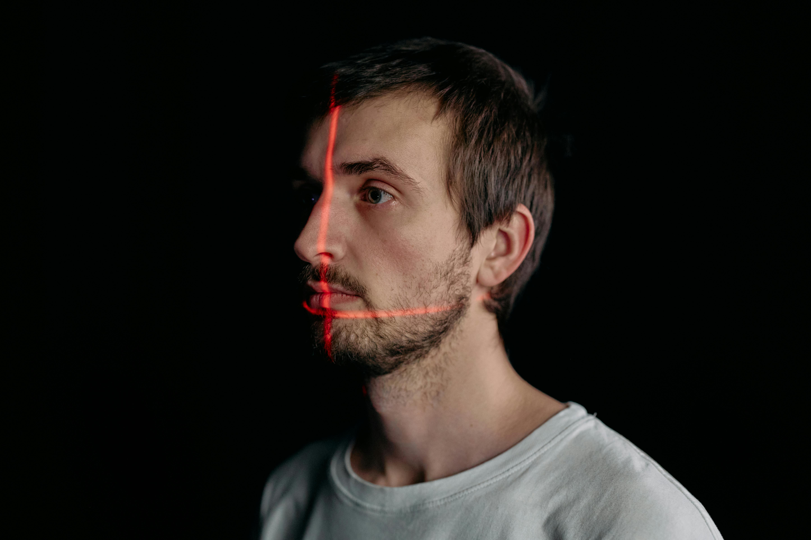
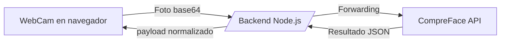

# FaceApp · Reconocimiento facial asistido por CompreFace


<!--  -->

<video src="src/5818973-uhd_3840_2160_24fps.mp4" controls width="100%" poster="image/faceapp-video-cover.png"></video>

---

## Tabla de contenidos
1. [Resumen del stack](#resumen-del-stack)
2. [Arquitectura y flujo de datos](#arquitectura-y-flujo-de-datos)
3. [Requisitos previos](#requisitos-previos)
4. [Configuración rápida](#configuración-rápida)
5. [Variables de entorno](#variables-de-entorno)
6. [Scripts habituales](#scripts-habituales)
7. [API interna](#api-interna)
8. [Frontend](#frontend)
9. [Workflows recomendados](#workflows-recomendados)
10. [Roadmap](#roadmap)
11. [Licencia](#licencia)

---

## Resumen del stack

| Componente | Descripción |
|------------|-------------|
| Backend Node.js | expone `/capture` y `/recognize` contra CompreFace |
| CompreFace | orquestado vía Docker desde [CompreFaceDok](CompreFaceDok) |
| Frontend Vite + React + TS | interfaz WebCam en [FrontEnd/faceApp](FrontEnd/faceApp) |
| Almacenamiento temporal | imágenes intermedias en `TempImage/` e `image/` |

---

## Arquitectura y flujo de datos



1. [`WebCapture`](FrontEnd/faceApp/src/components/WebCapture.tsx) obtiene frames con `react-webcam`.
2. Se dispara `/capture` para inscribir un rostro nuevo o `/recognize` para compararlo.
3. El backend formatea la imagen y la envía al stack CompreFace levantado desde Docker.
4. El frontend muestra similitud, probabilidad y metadatos.

---

## Requisitos previos

- Node.js ≥ 18
- npm o pnpm
- Docker + Docker Compose (para CompreFace)
- Cámara local o virtual habilitada en el navegador
- Variables `.env` configuradas tanto en la raíz como en `FrontEnd/faceApp/` y `CompreFaceDok/`

---

## Configuración rápida

1. **Backend**
   ```sh
   npm install
   npm run dev
   ```
2. **CompreFace**
   ```sh
   cd CompreFaceDok
   docker compose up -d
   ```
3. **Frontend**
   ```sh
   cd FrontEnd/faceApp
   npm install
   npm run dev
   ```
4. Abrir `http://localhost:5173` (o el puerto configurado) y probar la cámara.

---

## Variables de entorno

| Archivo | Clave | Significado |
|---------|-------|-------------|
| `.env` | `PORT`, `COMPREFACE_URL`, `COMPREFACE_KEY` | Backend / proxy hacia CompreFace |
| `FrontEnd/faceApp/.env` | `VITE_API_URL` | URL pública del backend |
| `CompreFaceDok/.env` | Credenciales y llaves internas | Servicio CompreFace |

---

## Scripts habituales

### Raíz (backend)
- `npm run dev` · modo desarrollo con recarga.
- `npm run start` · ejecución productiva.

### Frontend Vite
- `npm run dev` · servidor local de Vite.
- `npm run build` · bundle listo para deploy.
- `npm run preview` · verificación del build.

### CompreFace
- `docker compose up -d` · levanta los contenedores.
- `docker compose logs -f` · seguimiento de inferencias.

---

## API interna

| Método | Endpoint | Cuerpo | Respuesta |
|--------|----------|--------|-----------|
| `POST` | `/capture` | `{ image: string, name: string }` | Detalles del rostro agregado |
| `POST` | `/recognize` | `{ image: string }` | Lista de sujetos, similitud y caja |

> Las imágenes se envían en base64 (`data:image/jpeg;base64,...`).  

En el frontend puedes alternar entre modos **New** y **Recognize** mediante el selector integrado en [`WebCapture`](FrontEnd/faceApp/src/components/WebCapture.tsx).

---

## Frontend

- Basado en Vite + React + TS; estilos locales por componente `src/components/TodosLosComponentes.css`.
- `react-webcam` captura imágenes a 1280×720, espejo activado.
- Manejo de estados para resultados positivos, vacíos y errores.
- UI responsiva con botón único que cambia de comportamiento según el modo seleccionado.

---

## Workflows recomendados

1. **Entrenamiento rápido**
   - Selecciona _New_, captura varias fotos por sujeto con diferentes ángulos.
   - Verifica en la respuesta que recibes `image_id`.
2. **Reconocimiento**
   - Cambia a _Recognize_ y compara contra la galería creada.
   - Ajusta umbrales en CompreFace si necesitas mayor precisión.
3. **Depuración**
   - Usa el panel `docker compose logs` para revisar el pipeline ML.
   - Activa el inspector de red del navegador y valida payloads.

---

## Roadmap

- [ ] Persistencia avanzada de perfiles con metadatos externos.
- [ ] Notificaciones push cuando se detecte un rostro conocido.
- [ ] Optimización WebGL para filtros previos a la captura.
- [ ] Tests e2e para la UI de cámara.